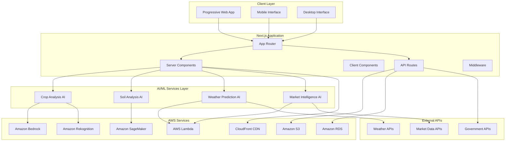

# Design Document: AgroNova Platform

## Overview

AgroNova is an AI-powered agricultural platform built with Next.js and TypeScript, designed to empower farmers and agricultural stakeholders with intelligent decision-making tools. The platform leverages AWS AI/ML services to provide comprehensive agricultural insights including crop analysis, soil recommendations, weather predictions, market intelligence, and community features.

The platform follows a modern, scalable architecture using Next.js App Router, server-side rendering for optimal performance, and a microservices approach for AI/ML integrations. The design emphasizes mobile-first user experience, offline capabilities, and multi-language support to serve India's diverse farming community.

## Architecture

### High-Level Architecture



### Technology Stack

**Frontend:**
- Next.js 14+ with App Router for optimal performance and SEO
- TypeScript for type safety and developer experience
- Tailwind CSS for responsive, mobile-first design
- React Hook Form for efficient form handling
- Zustand for lightweight state management
- React Query for server state management and caching

**Backend & AI/ML:**
- AWS Lambda for serverless compute
- Amazon Bedrock for multi-modal LLM capabilities
- Amazon Rekognition for image analysis
- Amazon SageMaker for custom ML models
- Amazon S3 for file storage and static assets
- Amazon RDS (PostgreSQL) for relational data
- Amazon ElastiCache for caching

**Infrastructure:**
- AWS CloudFront for global content delivery
- AWS API Gateway for API management
- AWS Cognito for authentication
- AWS EventBridge for event-driven architecture
- AWS CloudWatch for monitoring and logging

## Components and Interfaces

### Core Components

#### 1. AI Crop Analyzer Component

**Purpose:** Handles crop image analysis and disease/pest detection

**Key Features:**
- Multi-modal image analysis using Amazon Bedrock
- Real-time crop health assessment
- Disease and pest identification
- Treatment recommendation generation

**Interface:**
```typescript
interface CropAnalysisRequest {
  imageUrl: string;
  cropType?: string;
  location: GeoLocation;
  captureDate: Date;
  fieldId?: string;
}

interface CropAnalysisResponse {
  cropType: string;
  confidence: number;
  healthStatus: 'healthy' | 'diseased' | 'pest_damage' | 'nutrient_deficiency';
  issues: CropIssue[];
  recommendations: Treatment[];
  severity: 'low' | 'medium' | 'high' | 'critical';
}

interface CropIssue {
  type: 'disease' | 'pest' | 'nutrient' | 'environmental';
  name: string;
  confidence: number;
  description: string;
  affectedArea: number; // percentage
}
```

#### 2. Soil Analysis Component

**Purpose:** Processes soil data and generates recommendations

**Key Features:**
- Multi-parameter soil analysis
- Fertilizer recommendation engine
- Crop suitability assessment
- Seasonal adjustment algorithms

**Interface:**
```typescript
interface SoilAnalysisRequest {
  soilData: SoilParameters;
  location: GeoLocation;
  cropType?: string;
  season: Season;
  testDate: Date;
}

interface SoilParameters {
  pH: number;
  nitrogen: number;
  phosphorus: number;
  potassium: number;
  organicMatter: number;
  moisture: number;
  temperature: number;
}

interface SoilAnalysisResponse {
  overallHealth: 'excellent' | 'good' | 'fair' | 'poor';
  nutrientStatus: NutrientStatus[];
  recommendations: SoilRecommendation[];
  suitableCrops: CropSuitability[];
  estimatedCost: number;
}
```

#### 3. Weather Prediction Component

**Purpose:** Provides weather impact analysis and farming recommendations

**Key Features:**
- 7-day weather impact forecasting
- Crop-specific weather alerts
- Optimal timing recommendations
- Risk assessment and mitigation

**Interface:**
```typescript
interface WeatherPredictionRequest {
  location: GeoLocation;
  cropTypes: string[];
  forecastDays: number;
  currentGrowthStage?: GrowthStage;
}

interface WeatherPredictionResponse {
  forecast: WeatherForecast[];
  alerts: WeatherAlert[];
  recommendations: WeatherRecommendation[];
  riskAssessment: RiskLevel;
}

interface WeatherAlert {
  type: 'drought' | 'flood' | 'frost' | 'hail' | 'wind';
  severity: 'low' | 'medium' | 'high' | 'extreme';
  startDate: Date;
  endDate: Date;
  description: string;
  actionRequired: string[];
}
```

#### 4. Market Intelligence Component

**Purpose:** Provides market analysis and price predictions

**Key Features:**
- Real-time price tracking
- 30-day price predictions
- Market trend analysis
- Optimal selling recommendations

**Interface:**
```typescript
interface MarketIntelligenceRequest {
  commodity: string;
  location: GeoLocation;
  quantity?: number;
  quality?: QualityGrade;
  timeframe: number; // days
}

interface MarketIntelligenceResponse {
  currentPrice: PriceData;
  priceHistory: PriceData[];
  pricePrediction: PricePrediction[];
  marketTrends: MarketTrend[];
  recommendations: MarketRecommendation[];
}

interface PricePrediction {
  date: Date;
  predictedPrice: number;
  confidence: number;
  factors: PriceInfluencer[];
}
```

#### 5. Community Platform Component

**Purpose:** Facilitates farmer interactions and knowledge sharing

**Key Features:**
- Multi-language support
- Expert consultation system
- Location-based grouping
- Content moderation

**Interface:**
```typescript
interface CommunityPost {
  id: string;
  authorId: string;
  content: string;
  images?: string[];
  tags: string[];
  location?: GeoLocation;
  language: string;
  createdAt: Date;
  likes: number;
  replies: CommunityReply[];
}

interface ExpertConsultation {
  id: string;
  farmerId: string;
  expertId: string;
  topic: string;
  description: string;
  images?: string[];
  status: 'pending' | 'in_progress' | 'completed';
  scheduledAt?: Date;
}
```

### Data Models

#### User Models

```typescript
interface Farmer {
  id: string;
  name: string;
  email: string;
  phone: string;
  location: GeoLocation;
  farmSize: number; // in acres
  primaryCrops: string[];
  languages: string[];
  experienceLevel: 'beginner' | 'intermediate' | 'expert';
  verificationStatus: 'pending' | 'verified' | 'rejected';
  createdAt: Date;
  lastActive: Date;
}

interface Expert {
  id: string;
  name: string;
  email: string;
  specialization: string[];
  credentials: Credential[];
  rating: number;
  consultationRate: number;
  availability: AvailabilitySlot[];
  languages: string[];
}
```

#### Agricultural Models

```typescript
interface Farm {
  id: string;
  farmerId: string;
  name: string;
  location: GeoLocation;
  totalArea: number;
  fields: Field[];
  soilType: string;
  irrigationType: string[];
  createdAt: Date;
}

interface Field {
  id: string;
  farmId: string;
  name: string;
  area: number;
  coordinates: Coordinate[];
  currentCrop?: string;
  plantingDate?: Date;
  expectedHarvest?: Date;
  soilData?: SoilParameters;
  cropHistory: CropHistory[];
}

interface CropHistory {
  cropType: string;
  plantingDate: Date;
  harvestDate: Date;
  yield: number;
  quality: QualityGrade;
  revenue: number;
  costs: CostBreakdown;
}
```

#### Marketplace Models

```typescript
interface ProductListing {
  id: string;
  sellerId: string;
  productType: 'produce' | 'seeds' | 'fertilizer' | 'equipment' | 'service';
  name: string;
  description: string;
  images: string[];
  price: number;
  unit: string;
  quantity: number;
  location: GeoLocation;
  qualityGrade?: QualityGrade;
  harvestDate?: Date;
  organicCertified: boolean;
  status: 'active' | 'sold' | 'expired';
  createdAt: Date;
}

interface Transaction {
  id: string;
  buyerId: string;
  sellerId: string;
  listingId: string;
  quantity: number;
  totalAmount: number;
  status: 'pending' | 'confirmed' | 'shipped' | 'delivered' | 'completed' | 'cancelled';
  paymentMethod: string;
  deliveryAddress: Address;
  createdAt: Date;
  completedAt?: Date;
}
```

## Correctness Properties

*A property is a characteristic or behavior that should hold true across all valid executions of a system—essentially, a formal statement about what the system should do. Properties serve as the bridge between human-readable specifications and machine-verifiable correctness guarantees.*

### Property Reflection

After analyzing all acceptance criteria, several properties can be consolidated to eliminate redundancy:

- Properties related to data storage and retrieval can be combined into comprehensive persistence properties
- Multiple alert/notification properties can be unified into a single notification reliability property  
- Various recommendation generation properties can be consolidated into recommendation completeness properties
- Language support properties can be combined into a single internationalization property

### Core Properties

**Property 1: AI Analysis Accuracy**
*For any* valid crop image uploaded to the system, the AI_Crop_Analyzer should identify the crop type with at least 90% accuracy when the crop type is among the 20 supported major Indian crop types
**Validates: Requirements 1.1, 1.6**

**Property 2: Disease and Pest Detection Completeness**
*For any* crop image containing visible diseases or pest damage, the AI_Crop_Analyzer should detect and classify the issue type, and provide specific treatment recommendations
**Validates: Requirements 1.2, 1.3, 1.4**

**Property 3: Analysis Result Persistence**
*For any* analysis operation (crop, soil, weather, or market), the system should store the results and make them retrievable for future reference
**Validates: Requirements 1.7, 2.7, 3.7, 4.7**

**Property 4: Temporal Disease Tracking**
*For any* sequence of crop images from the same field uploaded over time, the AI_Crop_Analyzer should track disease progression and show changes in health status
**Validates: Requirements 1.5**

**Property 5: Comprehensive Soil Analysis**
*For any* soil sample data provided, the Soil_Analyzer should analyze all key parameters (pH, nutrients, organic matter) and generate fertilizer recommendations with cost estimates
**Validates: Requirements 2.1, 2.2, 2.7**

**Property 6: Soil-Based Crop Recommendations**
*For any* soil conditions analyzed, the Soil_Analyzer should recommend suitable crops and adjust recommendations based on seasonal changes
**Validates: Requirements 2.4, 2.5**

**Property 7: Soil Improvement Strategies**
*For any* suboptimal soil conditions detected, the Soil_Analyzer should suggest specific improvement strategies
**Validates: Requirements 2.3**

**Property 8: Weather Impact Forecasting**
*For any* available weather data and specified crop types, the Weather_Predictor should generate 7-day impact forecasts and optimal timing recommendations
**Validates: Requirements 3.1, 3.3**

**Property 9: Weather Alert Generation**
*For any* adverse weather conditions predicted (drought, excessive rainfall), the Weather_Predictor should generate appropriate alerts and protective/conservation strategies
**Validates: Requirements 3.2, 3.4, 3.5**

**Property 10: Weather Change Notifications**
*For any* significant changes in weather predictions, the system should notify all affected farmers immediately
**Validates: Requirements 3.7**

**Property 11: Market Price Availability**
*For any* major agricultural commodity, the Market_Intelligence should provide current prices, historical data, and 30-day price predictions
**Validates: Requirements 4.1, 4.2, 4.7**

**Property 12: Market Opportunity Identification**
*For any* price predictions and market demand changes, the Market_Intelligence should identify optimal selling opportunities and recommend crop selection for next season
**Validates: Requirements 4.3, 4.4**

**Property 13: Price Comparison and Alerts**
*For any* commodity and set price alerts, the Market_Intelligence should compare prices across markets and notify farmers when target prices are reached
**Validates: Requirements 4.5, 4.6**

**Property 14: Community Profile Creation**
*For any* farmer joining the platform, the Community_Platform should create a complete user profile with farming details
**Validates: Requirements 5.1**

**Property 15: Community Interaction Functionality**
*For any* farmer using the community features, the platform should enable posting questions, receiving answers, sharing stories, and connecting with location-based groups
**Validates: Requirements 5.2, 5.4, 5.5**

**Property 16: Expert Consultation Facilitation**
*For any* available agricultural experts, the Community_Platform should facilitate consultations with farmers
**Validates: Requirements 5.3**

**Property 17: Content Moderation**
*For any* content posted on the community platform, inappropriate content should be detected and removed automatically
**Validates: Requirements 5.7**

**Property 18: Marketplace Listing and Matching**
*For any* farmer listing produce or buyers searching for products, the Marketplace should enable listing creation with photos/descriptions and match buyers with relevant listings
**Validates: Requirements 6.1, 6.2**

**Property 19: Secure Transaction Processing**
*For any* transaction between buyers and sellers, the Marketplace should facilitate secure processing and provide rating/review capabilities
**Validates: Requirements 6.3, 6.5**

**Property 20: Supplier Connection and Dispute Resolution**
*For any* agricultural input needs or transaction disputes, the Marketplace should connect farmers with verified suppliers and provide resolution mechanisms
**Validates: Requirements 6.4, 6.6**

**Property 21: Government Scheme Display and Guidance**
*For any* farmer using the platform, the Government_Integration should display relevant schemes and guide eligible farmers through application processes
**Validates: Requirements 7.1, 7.2**

**Property 22: Application Tracking and Alerts**
*For any* government scheme applications, the system should track status, notify farmers of updates, and alert eligible farmers about new schemes
**Validates: Requirements 7.3, 7.4**

**Property 23: Document Support and Confirmation**
*For any* government scheme applications, the system should provide document templates, submission assistance, and confirmation receipts
**Validates: Requirements 7.5, 7.7**

**Property 24: Data Encryption and Authentication**
*For any* user data in the system, it should be encrypted in transit and at rest, with secure authentication implemented for all account creation
**Validates: Requirements 8.1, 8.2**

**Property 25: Consent and Data Rights**
*For any* data sharing with third parties, explicit user consent should be obtained, and users should have access to data export and deletion options
**Validates: Requirements 8.4, 8.5**

**Property 26: Security Breach Notification**
*For any* security breaches detected, affected users should be notified within 24 hours
**Validates: Requirements 8.6**

**Property 27: Role-Based Access Control**
*For any* user accessing the system, access should be properly restricted based on their assigned role
**Validates: Requirements 8.7**

**Property 28: Mobile-Responsive Interface**
*For any* device accessing the platform, the interface should be responsive and optimized for mobile devices
**Validates: Requirements 9.1**

**Property 29: Offline Functionality**
*For any* poor internet connectivity scenarios, the platform should maintain essential functionality through offline capabilities
**Validates: Requirements 9.2**

**Property 30: Voice Input and Image Optimization**
*For any* voice input in supported languages or image capture, the system should process voice commands correctly and optimize images for analysis while minimizing data usage
**Validates: Requirements 9.3, 9.4**

**Property 31: PWA and Performance**
*For any* device accessing the platform, PWA functionality should work correctly and maintain acceptable performance even on low-end devices
**Validates: Requirements 9.5, 9.6**

**Property 32: Multi-Language Support**
*For any* user interface element, the system should support all required Indian languages for both community platform and main interface
**Validates: Requirements 5.6, 9.7**

**Property 33: Farming Metrics Tracking**
*For any* farming activities, the system should track key metrics (yield, costs, profits) and generate performance trend reports from collected data
**Validates: Requirements 10.1, 10.2**

**Property 34: Performance Analysis and Recommendations**
*For any* farming data collected, the system should provide efficiency recommendations, seasonal comparisons, and regional benchmarking
**Validates: Requirements 10.3, 10.4, 10.5**

**Property 35: Insight Visualization and Export**
*For any* insights generated, the system should present them in understandable visualizations and support export in multiple formats
**Validates: Requirements 10.6, 10.7**

## Error Handling

### Error Categories and Strategies

**AI/ML Service Errors:**
- **Image Analysis Failures**: Implement fallback to basic image processing when AI services are unavailable
- **Model Confidence Thresholds**: Return uncertainty indicators when confidence is below acceptable levels
- **Service Timeouts**: Provide graceful degradation with cached results or alternative recommendations

**Data Validation Errors:**
- **Invalid Soil Parameters**: Validate ranges and provide clear error messages for out-of-bounds values
- **Corrupted Image Uploads**: Implement client-side validation and server-side sanitization
- **Missing Required Fields**: Progressive form validation with helpful guidance

**External API Failures:**
- **Weather Service Outages**: Cache recent weather data and use historical patterns as fallback
- **Market Data Unavailability**: Display last known prices with timestamps and uncertainty indicators
- **Government Portal Integration Issues**: Queue applications for retry and notify users of delays

**Network and Connectivity Issues:**
- **Offline Mode**: Cache critical data locally and sync when connectivity returns
- **Slow Connections**: Implement progressive loading and image compression
- **Intermittent Failures**: Automatic retry with exponential backoff

**User Input Errors:**
- **Invalid Crop Images**: Provide clear guidance on image quality requirements
- **Incorrect Location Data**: Validate coordinates and provide location selection assistance
- **Language Barriers**: Offer voice input and visual guidance for complex forms

### Error Recovery Mechanisms

```typescript
interface ErrorRecoveryStrategy {
  errorType: string;
  fallbackAction: string;
  userNotification: string;
  retryPolicy: RetryPolicy;
  escalationPath?: string;
}

interface RetryPolicy {
  maxAttempts: number;
  backoffStrategy: 'linear' | 'exponential';
  baseDelay: number;
  maxDelay: number;
}
```

## Testing Strategy

### Dual Testing Approach

The AgroNova platform requires both unit testing and property-based testing to ensure comprehensive coverage:

**Unit Tests:**
- Focus on specific examples, edge cases, and error conditions
- Test integration points between components
- Validate specific business logic scenarios
- Test error handling and recovery mechanisms

**Property-Based Tests:**
- Verify universal properties across all inputs using randomized data
- Test AI/ML model behavior with diverse input sets
- Validate data consistency and persistence properties
- Ensure security and access control properties hold universally

### Property-Based Testing Configuration

**Testing Framework:** Fast-check for TypeScript/JavaScript property-based testing
**Test Configuration:**
- Minimum 100 iterations per property test
- Custom generators for agricultural data (crop types, soil parameters, weather conditions)
- Shrinking enabled for minimal failing examples
- Timeout configuration for AI/ML service calls

**Test Tagging Format:**
Each property-based test must include a comment referencing the design document property:
```typescript
// Feature: agronova-platform, Property 1: AI Analysis Accuracy
```

### Testing Categories

**AI/ML Component Testing:**
- Property tests for accuracy thresholds across diverse inputs
- Unit tests for specific crop types and known disease patterns
- Integration tests for AI service fallback mechanisms
- Performance tests for response time requirements

**Data Layer Testing:**
- Property tests for data persistence and retrieval consistency
- Unit tests for data validation and sanitization
- Integration tests for database transactions and rollbacks
- Security tests for data encryption and access controls

**API Testing:**
- Property tests for API response consistency and format
- Unit tests for specific endpoint behaviors and error cases
- Integration tests for external service interactions
- Load tests for concurrent user scenarios

**UI/UX Testing:**
- Property tests for responsive design across device sizes
- Unit tests for specific user interaction flows
- Integration tests for offline functionality
- Accessibility tests for multi-language support

### Test Data Management

**Synthetic Data Generation:**
- Crop image datasets with known classifications
- Soil parameter ranges based on Indian agricultural data
- Weather pattern simulations for various regions
- Market price historical data for trend testing

**Test Environment Setup:**
- Isolated test databases with seed data
- Mock AI/ML services for consistent testing
- Simulated external API responses
- Multi-language test content validation

### Continuous Testing Pipeline

**Pre-commit Testing:**
- Unit tests for changed components
- Linting and type checking
- Basic property test sampling

**CI/CD Pipeline Testing:**
- Full property-based test suite execution
- Integration tests with external services
- Performance regression testing
- Security vulnerability scanning

**Production Monitoring:**
- Real-time AI model accuracy tracking
- User experience metrics collection
- Error rate monitoring and alerting
- Performance baseline maintenance