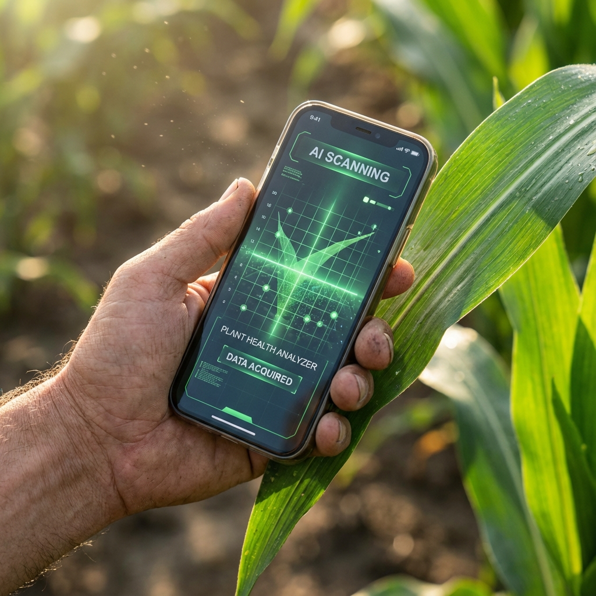

# AgroNova - The Future of Smart Farming

AgroNova is a comprehensive digital ecosystem designed to empower farmers with AI-driven insights, direct market access, and a thriving community. It bridges the gap between technology and agriculture, ensuring farmers get the best value for their produce and labor.



## Key Features

### **Farm Intelligence Dashboard**

- **Hyper-Local Weather**: Real-time accurate weather forecasts with crop-specific advisories.
- **Soil Health Analysis**: Upload soil reports to get detailed NPK and pH breakdown with remediation tips.
- **Pest Detection AI**: Instant disease identification by uploading crop photos, powered by advanced computer vision.

### **Agri Store Pro**

- **Direct-to-Consumer Marketplace**: Farmers can list produce directly, setting their own prices.
- **Secure Checkout**: Integrated checkout flow with Location GPS and UPI payment verification.
- **Zero Middlemen**: 100% of the profit goes to the farmer.

### **Farmer's Community**

- **Social Feed**: Share updates, photos, and success stories with fellow farmers.
- **Network & Connect**: Follow experts, message peers, and build your agricultural network.
- **Discussion Forums**: Ask questions and get advice from the community.

### **Reports & Analytics**

- **Yield Forecasting**: AI-predicted yield estimates based on farm size and crop data.
- **Financial Projections**: Revenue and profit estimation to help plan the season.
- **Smart Recommendations**: Tailored tips to improve productivity.

## Tech Stack

- **Framework**: [Next.js 15](https://nextjs.org/) (App Router)
- **Styling**: [Tailwind CSS v4](https://tailwindcss.com/)
- **UI Components**: Custom clean UI + Tabler Icons
- **Animations**: Framer Motion
- **State Management**: React Context (Auth)
- **Database**: JSON-based local persistence (MVP) / scalable to Postgres/MongoDB.

## Getting Started

### Prerequisites

- Node.js 18+
- npm or bun

### Installation

1. **Clone the repository**

   ```bash
   git clone https://github.com/your-username/agronova.git
   cd agronova
   ```

2. **Install Dependencies**

   ```bash
   npm install
   ```

3. **Run Development Server**

   ```bash
   npm run dev
   ```

   Open [https://agronova-app.vercel.app](https://agronova-app.vercel.app) to view the app.

4. **Build for Production**
   ```bash
   npm run build
   npm start
   ```

## Deployment

This project is optimized for deployment on **Vercel**.

1. Push code to GitHub.
2. Import repository in Vercel.
3. Deploy! (No complex config required).

## Contributing

We welcome contributions to help Indian farmers! Please fork the repo and submit a PR.

## License

MIT License © 2024 AgroNova